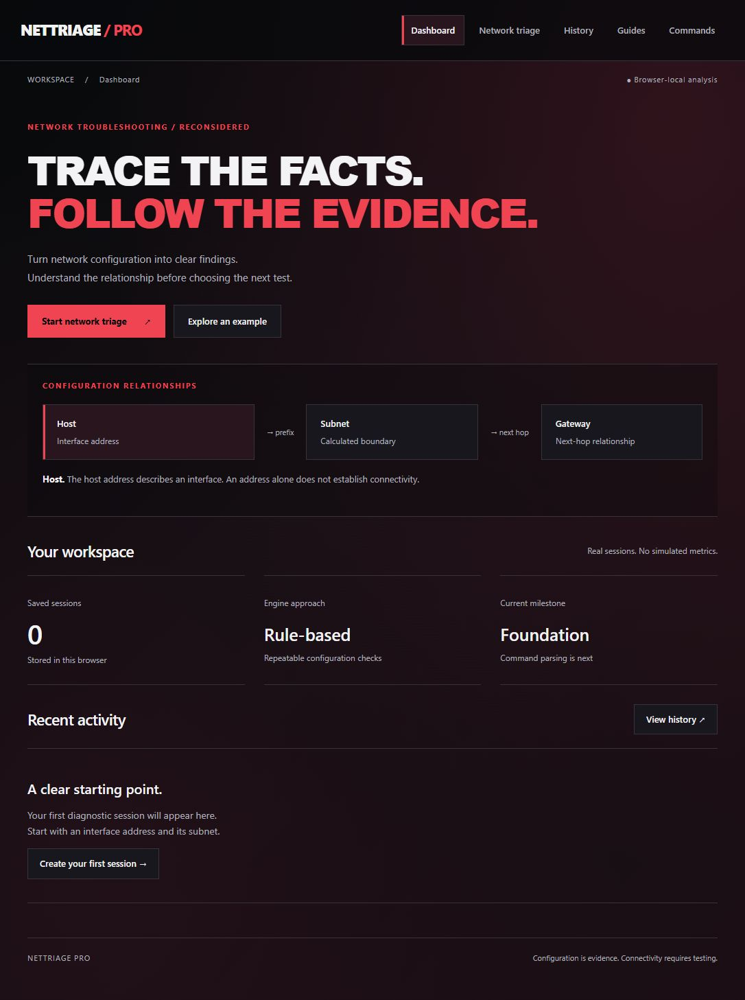

# NetTriage Pro

A browser-local, deterministic network troubleshooting application built to explain **what the evidence supports, what it cannot establish, and which test to run next**.

**Status: v0.1 foundation, actively developed.** Configuration diagnostics are implemented. Pasted command-output analysis is planned; this is not a completed v1.0 release.

## Motivation

Network troubleshooting is often reduced to guesses after one failed ping. NetTriage Pro demonstrates IPv4 mathematics, gateway relationships, careful diagnostic confidence, and repeatable testing. The application is independent source code with no Base44 runtime, backend, or generative diagnosis.

## Implemented features

- Dashboard showing actual browser-local session history.
- Strict IPv4 validation and contiguous dotted mask / CIDR parsing.
- Unsigned subnet calculations across /0 through /32, with explicit /31 point-to-point and /32 host-route assumptions.
- Private, link-local/APIPA, loopback, multicast, reserved, documentation, shared, and selected special-purpose categories.
- Gateway membership, host boundary, gateway/host collision, and unsuitable resolver address checks.
- Findings with severity, confidence, evidence, meaning, and recommended next test.
- Up to 50 saved configuration snapshots, reopening, individual deletion, and clearing history.
- Approved Redline Editorial interface: black-to-burgundy gradient, red accents, top navigation, editorial findings, labeled fields, visible keyboard focus, and responsive layouts.
- Selectable conceptual host/subnet/gateway explanations and an accessible clear-history confirmation.
- Troubleshooting guides and copyable Windows/Linux/macOS command references, with 15 expandable simulated-output walkthroughs and seven dated Windows observations.

## Local setup

Install Node.js 22.12 or newer (Node 24 is used for development).

For the exact checked-in dependency resolution:

```sh
npm install -g pnpm@11.19.0
pnpm install --frozen-lockfile
pnpm dev
pnpm test
pnpm build
```

The same package scripts are available through npm:

```sh
npm install
npm run dev
npm test
npm run build
```

The pnpm lockfile is the authoritative dependency lock. npm installation resolves the package.json ranges; no npm lockfile is checked in yet. Development binds to loopback; open the address displayed by Vite. Building writes a static application into `dist/`. No deployment provider has been chosen.

## Architecture

```text
Form input → normalization → validation → IPv4 calculations
          → configuration rules → structured findings → React presentation
                                ↘ local session snapshots
```

- `src/network/ipv4.ts`: strict parsing, mask conversion, subnet arithmetic, category checks.
- `src/diagnostics/engine.ts`: input/result contracts and deterministic configuration rules.
- `src/lib/history.ts`: versioned storage validation, cap, and failure reporting.
- `src/components/Findings.tsx`: evidence-oriented result presentation.
- `src/components/ConfigurationMap.tsx`: conceptual relationship explanations; no live network detection.
- `src/components/ConfirmClearHistory.tsx`: keyboard-accessible clear confirmation.
- `src/pages/Reference.tsx`: guides and command reference.
- `src/data/commandWalkthrough.ts`: reviewed illustrative fixtures and historical execution summaries. Regenerate with `node scripts/build-command-walkthrough.mjs` after updating the command report, then format the generated source.
- `tests/`: mathematical, rule, persistence, and rendering regression tests.

The next increment inserts evidence parsing and modular command rules before findings. The UI consumes results and does not contain networking calculations.

## Example workflow

1. Open **Network triage** and load the synthetic example.
2. Analyze `192.168.10.42/24` with gateway `192.168.20.1`.
3. Observe the confirmed mathematical finding: the gateway is outside `192.168.10.0/24`.
4. Read the caveat: explicit on-link routes and tunnels can be exceptions. Inspect the routing table before changing the gateway.
5. Open the session from **History**. Connectivity remains unverified because no command evidence has been analyzed.

## Screenshots



## Testing

Run `pnpm test` or `npm test`. The initial suite covers malformed IPs/masks, unsigned addressing, prefix boundaries, host ranges, special-purpose categories, APIPA, gateway membership across octet boundaries, empty evidence, invalid inputs, storage corruption/denial, persistence round-trips, the history cap, and misleading empty-state prevention.

The current suite has 60 passing checks. See [foundation verification](docs/verification.md), [Redline implementation verification](docs/redline-verification.md), [command walkthrough](docs/command-verification.md), [QA matrix](docs/test-matrix.md), and [bug log](docs/bugs.md). Passing unit tests do not establish real-world network reliability or full v1.0 coverage.

## Limitations and privacy

- No live network probes, interface discovery, command execution, packet capture, or backend.
- This build accepts configuration and notes only. Ping, DNS, traceroute, packet-loss and routing evidence parsers are not implemented yet.
- Notes are retained as context and never used as confirmed diagnostic evidence.
- `Public candidate` means outside the recognized special-purpose ranges; it does not establish assignment, global routing, or reachability. Special-purpose categories group blocks with differing routing policies; this is not a complete policy engine for the IANA registry.
- /31 assumes point-to-point usage; /32 gateway exceptions need routing evidence.
- History is browser-local, capped at 50, and can be removed by clearing browser storage. User-entered notes can contain sensitive information; delete sessions when no longer needed. No application requests transmit entered evidence.
- Corrupt history is preserved and reported; saving is blocked rather than silently replacing it. A dedicated recovery flow is planned.
- No public release, hosting, or software license has been selected. Dependency licenses remain their respective authors'.

## Roadmap

1. **v1.0:** English Windows/Unix ping, DNS, and traceroute parsers; target-aware evidence; packet-loss analysis; contradictory-evidence handling; modular rules; full scenario matrix; automated UI checks; final release QA and interview material.
2. **v1.1:** richer parsing and subnet visualization.
3. **v1.2:** report downloads and session export/import.
4. **v1.3:** expanded platform-specific workflows.
5. **v2.0:** IPv6.

## Engineering references

- [RFC 3021: /31 point-to-point links](https://www.rfc-editor.org/rfc/rfc3021)
- [IANA IPv4 special-purpose registry](https://www.iana.org/assignments/iana-ipv4-special-registry/)
- [Vite setup documentation](https://vite.dev/guide/)
- [Vitest documentation](https://vitest.dev/guide/)
