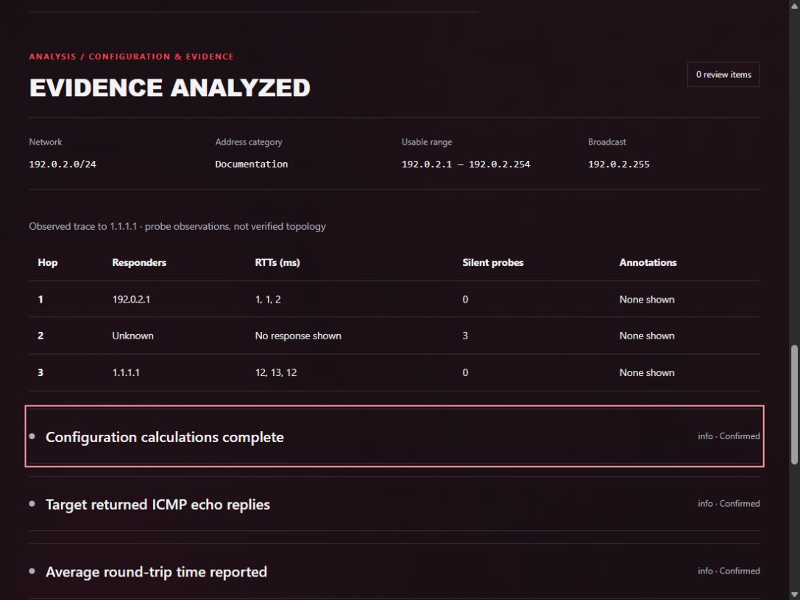
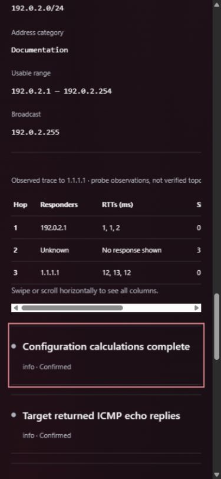

# Browser release simulations — October 7, 2026

The running HTTP preview tab became accessible through the supported in-app browser API. The separate earlier connection-error tab was left untouched. No policy bypass, alternate browser workaround, network probe or application code change was used.

## Results

| Check                                          | Status             | Evidence                                                                                                                                                                                            |
| ---------------------------------------------- | ------------------ | --------------------------------------------------------------------------------------------------------------------------------------------------------------------------------------------------- |
| Desktop/mobile pages                           | Pass               | All five pages at 1100, 390 and 320px. Document content width equaled viewport width throughout; triage help panel stayed inside the viewport.                                                      |
| Mobile results table                           | Pass               | At 390px, document widths both 375px; table scrolls inside its own region. Fresh screenshot inspected.                                                                                              |
| Keyboard/focus                                 | Pass               | Skip link focuses main. Tab shows visible solid focus outline. Invalid submission focuses IPv4; typing x changed bad to badx.                                                                       |
| Clear-history Cancel/Escape                    | Pass               | Both preserved baseline records; focus returned to Clear history. Shift+Tab wrapped to confirm, Tab returned to Cancel.                                                                             |
| Clear-history confirmation in isolated profile | Pass (user report) | User confirmed private-window confirmation, focus, reload persistence and original-session preservation working. Agent did not inspect this private profile.                                        |
| Command copying                                | Pass               | All 15 clipboard values matched their command labels. The initial ipconfig read mismatched; direct recheck showed Copied: ipconfig /all and exact clipboard text. No persistent failure reproduced. |
| Command walkthroughs/guides                    | Pass               | Fifteen disclosures expanded with fifteen nonempty outputs. Five guide headings rendered.                                                                                                           |
| Nine built-in simulations                      | Pass               | Replies, loss, unreachable, DNS answer/NXDOMAIN/timeout, destination response, bounded trace and prohibited probes produced their expected findings.                                                |
| Combined evidence                              | Pass               | Configuration, ping reply, DNS answer and trace destination facts shown alongside broader-connectivity uncertainty.                                                                                 |
| Invalid config with accepted evidence          | Pass               | Supported trace remained visible alongside configuration warning; invalid form prevented saving.                                                                                                    |
| Malformed evidence                             | Pass               | Ping/DNS/trace warnings shown with no misleading trace table.                                                                                                                                       |
| Conflicting ping                               | Pass               | Echo line plus zero-received summary flagged; success finding suppressed.                                                                                                                           |
| Incomplete ping                                | Pass               | Header-only sample remained incomplete; packet loss not invented.                                                                                                                                   |
| Stale results                                  | Pass               | Editing notes/evidence cleared previous results.                                                                                                                                                    |
| Persistence/reopen                             | Pass               | Synthetic sessions survived reload; raw !X evidence and findings restored on reopening.                                                                                                             |
| Delete persistence/history preservation        | Pass               | Ten clearly marked synthetic sessions created and individually removed. After reload, original two delete-button identifiers matched the baseline exactly. No existing session deleted or cleared.  |

No confirmed application issue was found in this pass. No product code or new regression tests were needed. The prior 187-test clean-checkout/build/format evidence is reused because runtime source is unchanged.

## Fresh visual evidence

Viewport overrides were reset. A combined synthetic result remains visible in the preview without adding a saved test session. Licensing, publication and deployment remain untouched.

## Remaining before final v1.0 declaration

The isolated-profile check is now Pass by user report. On October 7, the user confirmed the requested checks working after the private-window walkthrough: clearing, post-confirm focus, empty history after reload and original-session preservation. The agent did not observe the private profile directly. No new code change was required. Cross-browser/screen-reader coverage and documented unsupported formats remain limits; these results do not prove absence of every possible issue. See v1-readiness-summary.md for final approval choices.
