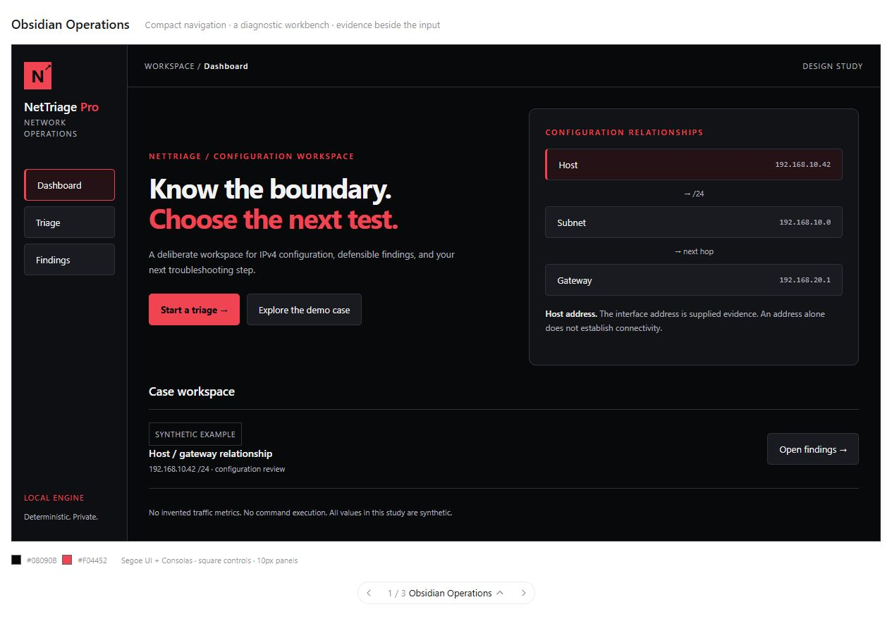
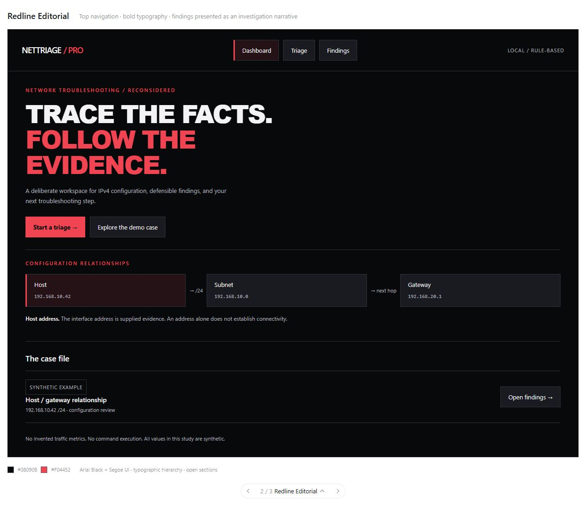
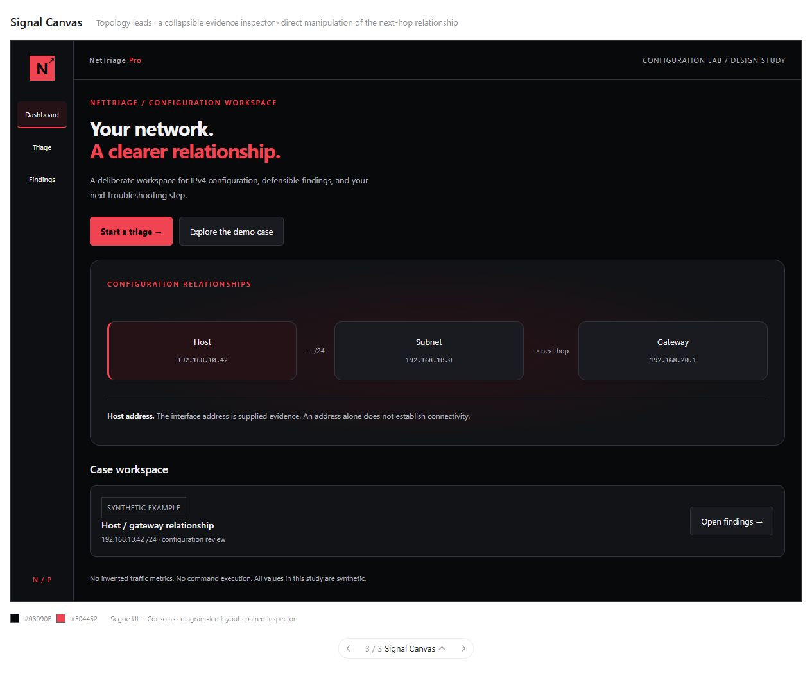

# Black and red design exploration

Three interactive sketches, prepared for selection before production changes. Existing application functionality and styling remain unchanged. All sketch cases are synthetic; these are design concepts, not additional shipped features.

## Obsidian Operations

**Layout:** compact full-height sidebar; dashboard pairs the primary action with a host/subnet/gateway relationship; triage uses a workbench with context beside the form; results expand evidence in place.

**Identity:** near-black #08090B, charcoal #121316, coral red #F04452, high-contrast white #F3F3F5, muted text #B0B1BD. Segoe UI for interface text and Consolas for addresses. Square controls with lightly rounded evidence panels.

**Interaction:** select topology nodes for evidence context; open the sample case; change its prefix or gateway and review mathematical relationships; expand/collapse findings.

**Distinctive quality:** feels like a purpose-built engineering workbench. It is the most straightforward evolution from the current application and favors dense, repeatable technician work.

## Redline Editorial

**Layout:** horizontal top navigation; a large, deliberate headline anchors the dashboard; open typographic sections replace rows of generic metric cards; the form follows a clear input-to-interpretation narrative; findings are substantial editorial rows.

**Identity:** the same accessible black/red family, with restrained red rules and uppercase Arial Black headlines. Segoe UI remains the readable body face. Minimal corner rounding and generous spacing.

**Interaction:** navigate Dashboard / Triage / Findings; the topology strip exposes each relationship; the form hands off to a readable case narrative; expandable evidence keeps the report concise.

**Distinctive quality:** strongest visual identity and portfolio presentation. Uses typography and composition instead of decorative effects. Recommended if the main objective is to stand apart visually while staying professional.

## Signal Canvas

**Layout:** a compact navigation rail leaves room for a topology-centered dashboard. Triage pairs an inspector with the diagram. Findings place editable configuration next to the evidence so a user can test a hypothesis without losing the relationship view.

**Identity:** black and charcoal canvas, red for active controls, white for node labels, monospace address labels. Softer panels and a restrained red-tinted topology field.

**Interaction:** select host/subnet/gateway nodes; change /24 to /16 to see an off-subnet gateway become an inside-subnet relationship; expand evidence; edit and rerun the synthetic case.

**Distinctive quality:** strongest interaction direction. More expressive than a standard dashboard; needs careful small-screen simplification during implementation.

## Shared design constraints

- Red indicates brand/action emphasis. Severity must also use explicit words and icons; it must not rely on red alone.
- No animated fake traffic, fake service status, invented KPIs, or automatic probing.
- Native buttons, labeled inputs, visible keyboard focus, and responsive stacking.
- No looping animations; reduced-motion preferences would apply to any later transitions.
- Sketches use system fonts, so no font downloads or additional licensing assumptions.
- The interactive case is intentionally limited to /16 and /24, validating mathematical membership only. The production engine retains its full existing prefix range.

## Decision

Await the user's selection. No redesign has been applied. A mixed direction is possible, such as Redline typography with Signal's relationship inspector, but it should be chosen deliberately before implementation.

## Review evidence

All three dashboard, triage, and findings views were exercised in the browser. Changing /24 to /16 changed the example gateway relationship as expected. At a 390px browser viewport, each dashboard's content and scroll widths both measured 343px inside the preview frame, with no document-level horizontal overflow. The inspected browser error/warning log was empty. These are initial sketch checks, not a complete accessibility audit.

An independent source/evidence review found no important issues. Production source was not modified, and its 56 tests still pass.

